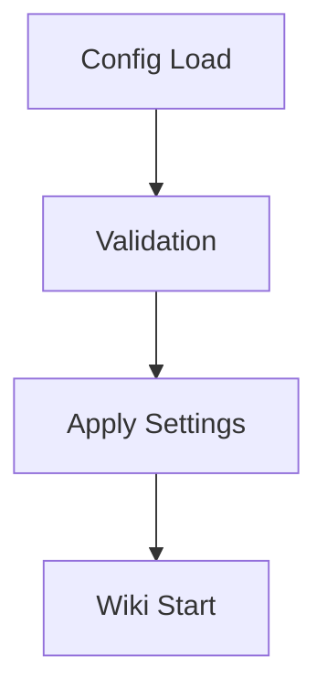

## Basic Configuration

You configure the wiki through a JSON file for personalized setup. This allows tailoring to specific degree programs like business or aviation.

<Callout kind="alert">

Always validate your config file before applying changes to prevent disruptions.

</Callout>

```json
{
  "theme": "liberty-dark",
  "language": "en",
  "autoSave": true,
  "searchIndex": true
}
```

<Steps>
  <Step title="Locate Config File" icon="file">

    Find config.json in your wiki root directory.

  </Step>
  <Step title="Edit Settings" icon="edit">

    Modify values using a text editor.

    ````javascript
    // Load and update config
    const config = await loadConfig();
    config.theme = 'christian-blue';
    await saveConfig(config);
    ````

  </Step>
  <Step title="Apply Changes" icon="refresh-cw">

    Restart the wiki server to activate.

    ````bash
    wiki restart --config updated
    ````

  </Step>
</Steps>

## Advanced Options

Enable plugins for extended functionality, such as Bible verse integration.

<Tabs>
  <Tab title="Plugins" icon="puzzle">

    Install community plugins for enhanced features.

    ````bash
    wiki plugin install bible-verses
    ````

  </Tab>
  <Tab title="API Keys" icon="key">

    Set up external service integrations.

    ````javascript
    config.integrations = {
      drive: { apiKey: 'your-google-key' },
      email: { smtp: 'liberty.smtp' }
    };
    ````

  </Tab>
</Tabs>

<ExpandableGroup>
  <Expandable title="Theme Customization">

    Adjust colors to match Liberty's branding with hex codes.

    <Columns cols={2}>
      <Card title="Primary Color" icon="palette" href="#">
        Set to #0b2143 for headers.
      </Card>
      <Card title="Accent Color" icon="sparkles" href="#">
        Use gold tones for highlights.
      </Card>
    </Columns>

  </Expandable>
  <Expandable title="Backup Settings">

    Schedule automatic backups to secure educational data.

    ````javascript
    config.backup = {
      interval: 'daily',
      location: './backups',
      retain: 30
    };
    ````

  </Expandable>
</ExpandableGroup>

## Security Configuration

Protect your wiki with authentication suited for university use.

<CodeGroup tabs="Local,Cloud">
  ```javascript
  // Local auth setup
  config.auth = {
    type: 'local',
    users: ['student@liberty.edu']
  };
  ```
  ```javascript
  // Cloud auth with Liberty SSO
  config.auth = {
    type: 'sso',
    provider: 'liberty-oauth',
    clientId: 'your-client-id'
  };
  ```
</CodeGroup>



You monitor logs for configuration issues. Test changes in a staging environment before production use. These steps ensure your wiki aligns with Liberty's Christian educational standards, supporting secure and efficient knowledge management across all 500+ programs.