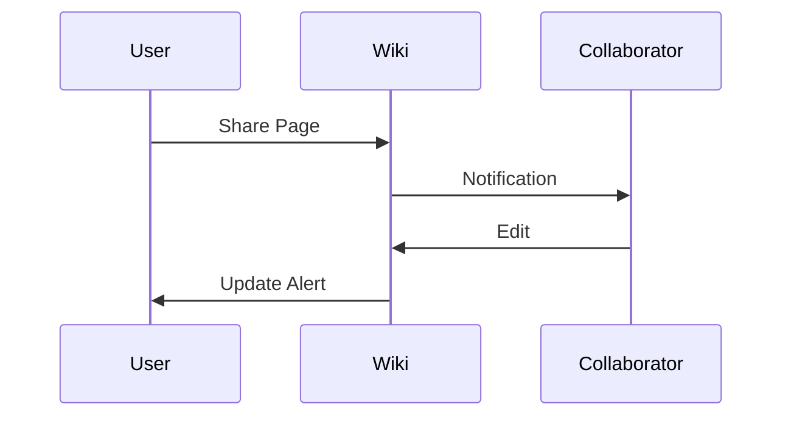

## Rich Text and Markdown Support

You edit content using familiar markdown syntax enhanced with visual aids. This feature streamlines note-taking for complex subjects like law or medicine at Liberty University.

<Callout kind="success">

Rich text preserves formatting from imported documents seamlessly.

</Callout>

<CodeGroup tabs="Markdown,HTML">
  ```markdown
  ## Christian Ethics in Business
  - Integrity first
  - Service-oriented leadership
  ```
  ```html
  <h2>Christian Ethics in Business</h2>
  <ul>
    <li>Integrity first</li>
    <li>Service-oriented leadership</li>
  </ul>
  ```
</CodeGroup>

## Search and Filtering

You search your wiki with advanced filters for quick retrieval. Boolean searches help locate specific references across theology or aviation notes.

<Tabs>
  <Tab title="Basic Search" icon="search">

    Enter keywords to find relevant pages.

    ````javascript
    const results = wiki.search('biblical worldview');
    results.forEach(page => console.log(page.title));
    ````

  </Tab>
  <Tab title="Advanced Filters" icon="filter">

    Filter by tags, dates, or folders.

    ````javascript
    const filtered = wiki.search('medicine', { tags: ['graduate'], dateFrom: '2023-01-01' });
    ````

  </Tab>
</Tabs>

## Collaboration Tools

Share pages with classmates or professors for feedback. Version history tracks changes, ensuring academic honesty in collaborative projects.

<Steps>
  <Step title="Invite Collaborator" icon="users">

    Add users via email from Liberty domain.

  </Step>
  <Step title="Review Changes" icon="eye">

    View diffs and approve edits.

    ````bash
    wiki collab review --page "Theology Notes" --user "professor@liberty.edu"
    ````

  </Step>
  <Step title="Merge Versions" icon="git-branch">

    Integrate contributions into main branch.

  </Step>
</Steps>

<Expandable title="Privacy Controls">

Set permissions to read-only for sensitive Christian studies content.

</Expandable>

## Integration Capabilities

Connect with external tools like Google Drive for importing syllabi. API access allows custom extensions for Liberty-specific workflows.

<Columns cols={3}>
  <Card title="Google Drive" icon="cloud" href="#">
    Import educational resources directly.
  </Card>
  <Card title="Email Alerts" icon="mail" href="#">
    Get notifications on updates.
  </Card>
  <Card title="Export Options" icon="download" href="#">
    Generate PDFs for printing.
  </Card>
</Columns>



You export wikis in various formats for thesis submissions. Mobile apps provide on-the-go access during campus events. These features enhance your learning experience at Liberty University, fostering both knowledge and faith-based growth. Security measures protect against unauthorized access, aligning with institutional policies.