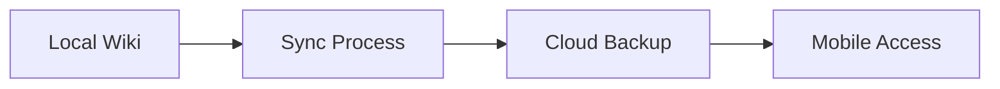

## Installation and Setup

You install CMHC Personal Wiki via npm for quick local development. This process takes less than five minutes and prepares your environment for creating educational wikis.

<Steps>
  <Step title="Prerequisites" icon="check">

    Ensure Node.js version 18 or higher is installed on your system.

  </Step>
  <Step title="Install Package" icon="download">

    Run the installation command in your terminal.

    ````bash
    npm install cmhc-personal-wiki
    ````

  </Step>
  <Step title="Initialize Wiki" icon="settings">

    Create your first wiki instance with initial configuration.

    ````javascript
    import { CMHCWiki } from 'cmhc-personal-wiki';
    const wiki = new CMHCWiki({
      rootDir: './my-wiki',
      theme: 'liberty-blue'
    });
    await wiki.init();
    ````

  </Step>
</Steps>

<Callout kind="tip">

Back up your configuration file regularly to avoid data loss during university projects.

</Callout>

## Creating Your First Page

You create pages to document course materials from Liberty University's programs. Start with a simple note on Christian foundations in education.

<Tabs>
  <Tab title="Web Interface" icon="globe">

    Access the dashboard and click 'New Page' to begin.

    ````html
    <div class="new-page-btn">Create Page</div>
    ````

  </Tab>
  <Tab title="CLI" icon="terminal">

    Use command line for batch creation of multiple pages.

    ````bash
    wiki page create --title "Aviation Studies" --content "Notes on flight principles with biblical ethics."
    ````

  </Tab>
</Tabs>

## Organizing Content

Structure your wiki using folders and tags for efficient navigation. You categorize content by degree level, such as bachelor's in business or master's in law.

<Columns cols={2}>
  <Card title="Folders" icon="folder" href="#">
    Create hierarchical structures for program-specific notes.
  </Card>
  <Card title="Tags" icon="tag" href="#">
    Label pages for quick filtering across 700+ options.
  </Card>
</Columns>

<ExpandableGroup>
  <Expandable title="Folder Best Practices" default-open="true">

    Nest folders like 'Undergraduate/Medicine' for targeted access.

  </Expandable>
  <Expandable title="Tagging Strategy">

    Use tags like 'christian-worldview' for cross-referencing.

    ````javascript
    wiki.tag.add('page-id', ['liberty', 'education']);
    ````

  </Expandable>
</ExpandableGroup>

## Syncing and Backup

You sync your wiki across devices for on-campus and online access. Enable automatic backups to cloud storage integrated with Liberty's systems.

<CodeGroup tabs="Node.js,Python">
  ```javascript
  // Sync configuration
  await wiki.sync({
    remote: 'https://liberty-cloud.com',
    auth: { token: 'your-liberty-token' }
  });
  ```
  ```python
  # Sync using Python client
  wiki.sync(remote='https://liberty-cloud.com', auth={'token': 'your-liberty-token'})
  ```
</CodeGroup>



Troubleshoot sync issues by checking network connectivity. Restore from backups if needed during semester transitions. This ensures continuity in your academic documentation.

You now have a functional wiki ready for extensive use in your Liberty University journey.