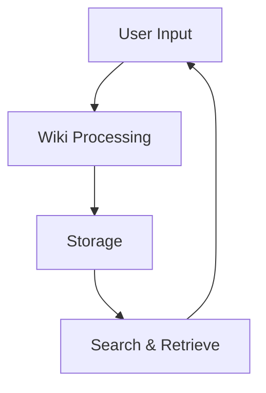

## Getting Started

You use CMHC Personal Wiki to create and manage personal knowledge bases with a focus on educational content rooted in Christian principles. This tool helps Liberty University students and faculty organize notes, research, and resources efficiently. Start by setting up your wiki to capture insights from over 700 degree programs offered.

<Columns cols={3}>
  <Card title="Quick Setup" icon="rocket" href="#">
    Set up your wiki in minutes and begin adding content immediately.
  </Card>
  <Card title="Christian Focus" icon="heart" href="#">
    Integrate biblical perspectives into your documentation workflows.
  </Card>
  <Card title="Collaboration" icon="users" href="#">
    Share and collaborate on educational materials securely.
  </Card>
</Columns>

<Callout kind="info">

Ensure you review the privacy settings to protect your personal educational notes.

</Callout>

## Core Features

You access a range of tools designed for academic use. The wiki supports rich text editing, tagging, and search functionalities tailored for university-level content.

<Tabs>
  <Tab title="Basic Editing" icon="edit">

    Edit pages using intuitive markdown support.

    ````markdown
    # Sample Page
    This is your educational note.
    ````

  </Tab>
  <Tab title="Search" icon="search">

    Search across all your wiki pages quickly.

    ````javascript
    // Example search integration
    const searchResults = await wiki.search('Liberty University');
    console.log(searchResults);
    ````

  </Tab>
</Tabs>

<Steps>
  <Step title="Create Account" icon="user">

    Sign up with your Liberty email to get started.

  </Step>
  <Step title="Add First Page" icon="plus">

    Create your initial wiki page for course notes on Christian worldview.

    ````bash
    wiki create --title "Introduction to Theology"
    ````

  </Step>
  <Step title="Organize Content" icon="folder">

    Use folders to structure your bachelor's or master's program materials.

  </Step>
</Steps>

<Expandable title="Advanced Tips" default-open="false">

You customize themes to match Liberty's branding. Import existing notes from various formats for seamless integration.

</Expandable>

## Why Choose CMHC Personal Wiki?

This wiki equips you with tools for success in academia. With support for over 500 degrees, you organize information from medicine to aviation studies. Professors' Christian teachings inspire content creation.



You benefit from offline access and mobile syncing. Export content in PDF for sharing with peers. The platform ensures data security compliant with educational standards.

<CodeGroup tabs="JavaScript,Python">
  ```javascript
const wiki = new CMHCWiki({ apiKey: 'your-key' });
const page = await wiki.createPage('New Note', 'Content here');
console.log(page.id);
```
  ```python
import cmhc_wiki
wiki = cmhc_wiki.Client(api_key='your-key')
page = wiki.create_page(title='New Note', content='Content here')
print(page.id)
```
</CodeGroup>

Integrate with Liberty's online programs for global access. Track revisions to maintain academic integrity. This setup fosters personal growth alongside scholarly pursuits.